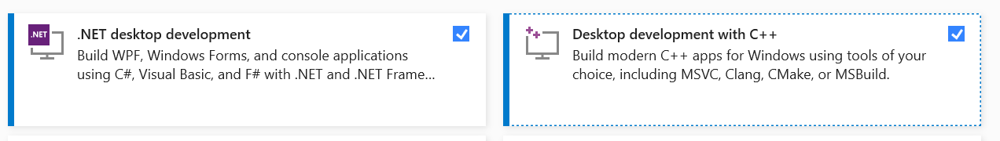

# Better Bravo Lights

This is the 'Better Bravo Lights' tool. It replaces the standard Honeycomb Bravo lights utility with a program which is easier to configure, more flexible and more responsive.

If you want to _use_ Better Bravo Lights, all the documentation is available at the Better Bravo Lights wiki:

https://github.com/RoystonS/BetterBravoLights/wiki

---

If you want to work on the Better Bravo Lights code, read on:

## Developer Documentation

If you'd like to work on the code, here's how to get going with it:

1. Install Visual Studio Community 2019 with C++ and C# support. 
2. `git clone` the codebase.
3. Install the MSFS SDK.
4. Open the `.sln` file.
5. Build the project.
6. Run `BravoLights`.
7. Run the unit tests in `BravoLights.Tests`. The tests are mostly for configuration parsing and expression parsing.
   No unit tests cover simulator interactions yet.

To work on the WASM module, build as above, but also:

1. Enter Dev mode in MSFS.
2. In the Dev mode File menu, open up the `MSFSWASMProject/BetterBravoLightsLVars.xml` project.
3. In the Project Editor window, click 'Build All'. This will assemble the WASM module (locking up MSFS for 10-15 seconds) and inject it into MSFS.
4. Develop the BetterBravoLights app against the injected WASM module.
5. To iterate with WASM changes, build the project and click 'Build All' again. That'll update the WASM module in MSFS.

To work on installation/uninstallation you'll need a copy of the assembled WASM module in the BravoLights `Debug` directory:

1. Run `assemble-wasm-for-ide.cmd` to assemble the WASM module (note: it uses whichever was last built out of Debug or Release WASM build)
   and copy it to the IDE output directories.

## Releasing

1. Change the version number on the main BravoLights assembly as desired. Follow https://semver.org/ versioning.
2. If the WASM protocol has changed, change the WASM module version in MSFSWASMProject\PackageDefinitions\better-bravo-lights-lvar-module.xml.
3. Using PowerShell, run `build-and-publish.ps1` from the root directory. It will build the projects, assemble the WASM module and package
   it all together into a `BetterBravoLights.zip` file in the root directory, ready for release.
4. Test that .zip.
5. Commit and tag the code in Git, and push it.
6. Create a release in GitHub against that tag, and upload `BetterBravoLights.zip` to it, with an appropriate changelog.
7. Upload the new `.zip` to `flightsim.to` with the new changelog.

## Manual Testing

### Test with a non-installed BBL

1. Start BBL
2. Check tray tooltip + A: + L: variable descriptions; should indicate no connection
3. Start MSFS
4. When connected, all should update to show connection
5. Missing LVars should report as not present yet
6. Test an aircraft with no/few LVars, e.g. C172
7. Check that lights go out in main menu
8. Launch TBM
9. Check new LVars are detected and work
10. Launch Hawk
11. Check new LVars
12. Stop sim
13. Check variables report no connection
