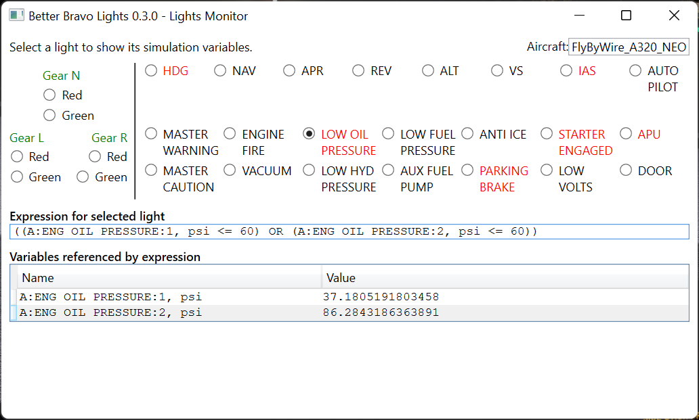

# Better Bravo Lights - Configuration

Configuring Better Bravo Lights (BBL) is simply a matter of editing the `Config.ini` file. You don't need to restart Better Bravo Lights or your flight. BBL monitors `Config.ini` for changes live and automatically reconfigures itself when the file is changed.

It's a good idea not to _guess_ at values such as the threshold for low oil pressure; instead, check the POH, or check in the actual aircraft module itself. (`panel.xml` or `cockpit.cfg` are good files to check as they describe annunciator configurations or the red/yellow/green ranges for panel gauges.)

If you make some useful configuration entries, please [share it with us on GitHub](https://github.com/RoystonS/BetterBravoLights/issues/new/choose) and we'll look at adding them to the default configuration for others to use!

## Configuration Files

As of v0.7.0, BBL has _two_ configuration files for describing the behaviour of lights:

1. an internal `Config.Builtin.ini` file which contains the configuration entries that BBL ships with; this lives in the `Program` folder.
2. a user-modifiable `Config.ini` file which is for your personal overrides.

Whenever BBL looks up a configuration value, entries in the user `Config.ini` file override those of the built-in `Config.Builtin.ini` file.

The intention is that you should carry your `Config.ini` file from one release of BBL to another, and that file should contain as little as possible. If you find yourself maintaining a large set of configuration, please [contact the BBL authors to see if you can get some of that configuration adopted by the product](https://github.com/RoystonS/BetterBravoLights/issues/new/choose).

## Configuration Syntax

The configuration file `Config.ini` is a standard [.ini file](https://en.wikipedia.org/wiki/INI_file).

### Comments

- Lines starting with a semicolon (`;`) are treated as comments and are ignored

### Sections

- The configuration file is broken up into sections, each beginning with a section name in square brackets. For example, `[Default]`.
- Configuration for an aircraft is in a section named `[Aircraft.<aircraftname>]`
  - For instance: `[Aircraft.Asobo_TBM930]` or `[Aircraft.Asobo_Pitts]`
  - You can find the name of the aircraft by looking in the BBL lights debugging page; it appears at the top-right.
- Each light setting line is of the format
  - `lightname = expression`
- Expression types:
  - variable expressions
    - `A:ELECTRICAL MAIN BUS VOLTAGE, volts`
      - Note that the full A: variable name is required together with the units.
      - A full list of A: variables can be found here: https://docs.flightsimulator.com/html/Programming_Tools/SimConnect/Status/Status_Of_Simulation_Variables.htm
      - _Indexed_ A: variables are supported. For instance, `A:ENG OIL PRESSURE:1` and `A:ENG OIL PRESSURE:2` are the different oil pressures for engines 1 and 2
    - `L:Generic_Master_Warning_Active`
      - No units are needed for L: variables
      - Many L: variables are aircraft-specific
  - literal numbers
    - decimal: `0`, `1`, `2.5`, `-42`
    - hexadecimal: `0x56d8`
  - fixed light values
    - `ON`
    - `OFF`
  - comparison expressions
    - `<` (less than)
    - `<=` (less than or equal to)
    - `==` (equal to)
    - `!=` (not equal to)
    - `>=` (greater than or equal to)
    - `>` (greater than)
  - arithmetic expressions
    - `+` (add)
    - `-` (subtract)
    - `*` (multiply)
    - `/` (divide)
  - bitwise expressions (new in v0.7.0)
    - `&` (bitwise AND); useful for checking sim vars which are masks ([`A:LIGHT ON STATES`](https://docs.flightsimulator.com/html/Programming_Tools/SimVars/Aircraft_SimVars/Aircraft_System_Variables.htm#LIGHT_ON_STATES) for example). `A:LIGHT ON STATES & 0x0008 == 0x0008` would check for the taxi lights being on.
    - `|` (bitwise OR)
  - logical expressions
    - `AND` (can also be written as `&&`)
    - `OR` (can also be written as `||`)
    - `NOT` (New in v0.5.0)
    - Note that both `AND` and `OR` are 'short-circuiting' operators as of v0.6.0. This means that if one side of the value is enough to determine the overall result of the expression, the other side of the value is irrelevant. For example:
      - `expr1 OR expr2` will evaluate to `true` if `expr1` is `true` irrespective of the value or error state of `expr2`
      - `expr1 AND expr2` will evaluate to `false` if `expr1` is `false` irrespective of the value or error state of `expr2`.
      - This has an impact on how erroneous (e.g. missing) `L:` variables are handled. See below.
  - grouping
    - standard arithmetic precedence (multiplication and division bind more tightly than addition and subtraction; AND binds more tightly than OR); this can be overridden with parentheses
    - `(1 + 2) * 3` is different from `1 + 2 * 3`
  - unary minus
    - `-4`, `-(3 + 4)`, `6 + -3`, `-(A:SOME VARIABLE, psi)` (New in v0.5.0)
- (New in v0.3.0) In an extension to standard `.ini` syntax, you can define multiple sections at the same time, to reduce duplication, by comma-separating the section names.

  For instance:

  ```ini
  [Aircraft.Aircraft1, Aircraft.Aircraft2]
  Light1 = A:SOME VARIABLE, bool == 1
  Light2 = A:OTHER VARIABLE, bool == 1
  ```

  is the same as writing

  ```ini
  [Aircraft.Aircraft1]
  Light1 = A:SOME VARIABLE, bool == 1
  Light2 = A:OTHER VARIABLE, bool == 1
  [Aircraft.Aircraft2]
  Light1 = A:SOME VARIABLE, bool == 1
  Light2 = A:OTHER VARIABLE, bool == 1
  ```

- (New in v0.3.0) The same section name can appear multiple times. Sections with the same name will be merged.
- Configuration in the section named `[Default]` automatically apply to every aircraft unless an aircraft overrides a light

### Error Handling

If expression mentions an `A:` variable or `L:` variable that does not (yet) exist, that _part_ of the expression will be considered to be 'in error', as will anything that depends on it.

For example, if `L:VAR1` exists but `L:VAR2` does not:

- the expression `L:VAR1 + L:VAR2` will itself be considered an error
- the expression `L:VAR1 OR L:VAR2` will evaluate to `true` if `L:VAR1` is `true` whether `L:VAR2` is `true` or `false` or erroring (due to the short-circuiting `OR` operator)
- the expression `L:VAR1 AND L:VAR2` will evaluate to `false` if `L:VAR1` is `false` whether `L:VAR2` is `true` or `false` or erroring (due to the short-circuiting `AND` operator)

In summary:

- any arithmetic expression (e.g. `L:VAR1 + 4`) involving an error will evaluate to an error
- any comparison expression (e.g. `L:VAR1 == 9`) involving an error will evaluate to an error
- any logical operator (e.g. `L:VAR1 == 9 OR L:VAR2 > 42`) involving an error will evaluate to an error _unless the other side of the operator is able to determine the result by itself_

If the overall expression for a light evaluates to an error, the light will be turned OFF.

The short-circuiting `OR` operator is particularly useful for generating configurations which are resilient to missing variables. For instance the configuration `Vacuum = L:VAR1 == 1 OR L:VAR2 == 1 OR L:VAR3 == 1` will light up the VACUUM light if _any_ of `L:VAR1`, `L:VAR2`, `L:VAR3` exist and have the value 1.

### Other Settings

As well as setting the configuration for lights (see the list of Light Names below), some other configuration settings can be made:

- `MasterEnable` (New in v0.7.0)

  - This is feature makes it easy to turn off all Bravo lights until a particular state has been reached, such as the master electrical bus or battery switch being on. `MasterEnable` should be given a standard light-enabled expression, which it then automatically `AND`s into every other light expression.

    For example, if we want our lights to turn on only once the main flight controls panel is on, we could write this rather repetitive configuration:

    ```
    [Aircraft.Something]
    MasterWarning = A:CIRCUIT GENERAL PANEL ON, bool == 1 AND L:Generic_Master_Warning_Active == 1
    ParkingBrake = A:CIRCUIT GENERAL PANEL ON, bool == 1 AND A:BRAKE PARKING POSITION, bool == 1
    Door = A:CIRCUIT GENERAL PANEL ON, bool == 1 AND (A:CANOPY OPEN, percent > 0 OR A:EXIT OPEN:0, percent > 0)
    ```

    or we can use `MasterEnable` to simplify it considerably:

    ```
    [Aircraft.Something]
    MasterEnable = A:CIRCUIT GENERAL PANEL ON, bool == 1

    MasterWarning = L:Generic_Master_Warning_Active == 1
    ParkingBrake = A:BRAKE PARKING POSITION, bool == 1
    Door = A:CANOPY OPEN, percent > 0 OR A:EXIT OPEN:0, percent > 0
    ```

    Note that when viewing light configurations in the debugger, expressions will show the `AND`ed `MasterEnable` configuration mixed
    into the configuration.

- `Invert` (New in v0.5.0)

  - This setting takes a comma-separated list of light names and arranges for their logic to be inverted.

    For example, if you wanted to operate the Bravo throttle in a dark room, and light the top row of auto-pilot buttons UNLESS activated, you would write:

    `Invert = HDG, NAV, APR, REV, ALT, VS, IAS, AUTOPILOT`

    It _is_ possible to apply this setting for individual aircraft, but it makes most sense in the `[Default]` section.

    Note that when viewing inverted lights in the debugger, their expressions will be shown with an extra `NOT` prefix for the expression: this is how the inverting logic works.

    The interaction between `MasterEnable` and `Invert` is such that `Invert`ing
    behaviour only takes effect after the `MasterEnable` condition has been passed. That is, for a configuration of:

    ```
    MasterEnable = EXPRESSION1
    Invert = HDG

    HDG = EXPRESSION2
    ```

    the expression used for the HDG light is `EXPRESSION1 AND (NOT EXPRESSION2)`

## Examples of light configurations

- `LowHydPressure = OFF`

  Specifies that the 'LOW HYD PRESSURE' light should be permanently off. This can be used to override configuration from the `[Default]` section which isn't appropriate for some specific aircraft

- `LowVolts = A:ELECTRICAL MAIN BUS VOLTAGE, volts < 24.5`

  Specifies that the 'LOW VOLTS' light should be on if the `ELECTRICAL MAIN BUS VOLTAGE` variable (measured in volts) is less than 24.5. Otherwise it should be off.

- `LowOilPressure = A:GENERAL ENG OIL PRESSURE:1, bar < 2.5`

  Specifies that the 'LOW OIL PRESSURE' light should be on if the `GENERAL ENG OIL PRESSURE` for engine 1 (measured in bars) is less than 2.5.

- `LowOilPressure = A:GENERAL ENG OIL PRESSURE:1, psi < 10`

  Specifies that the 'LOW OIL PRESSURE' light should be on if the `GENERAL ENG OIL PRESSURE` for engine 1 (measured in psi) is less than 10.

- `GearLRed = A:GEAR LEFT POSITION, percent over 100 > 0 AND A:GEAR LEFT POSITION, percent over 100 < 1`

  Specifies that the left gear red light should be on if the `GEAR LEFT POSITION` (measured in percent/100) is between 0 and 1 (but isn't exactly 0 nor exactly 1); this is how we specify that a gear light should be red if the gear is _partially_ down.

- `LowOilPressure = (A:GENERAL ENG OIL PRESSURE:1, psf > 0 AND A:GENERAL ENG OIL PRESSURE:1, psf < 15120) OR (A:GENERAL ENG OIL PRESSURE:2, psf > 0 AND A:GENERAL ENG OIL PRESSURE:2, psf < 15120)`

  Specifies that the 'LOW OIL PRESSURE' light should be on if either of the two engine's oil pressures is between 0 and 15120. It will _not_ be lit if the oil pressure is precisely 0 (which means it still works on a single-engine aircraft).

## Light Names

The light names largely match those found on the Bravo itself:

- Autopilot buttons
  - `HDG`, `NAV`, `APR`, `REV`, `ALT`, `VS`, `IAS`, `AUTOPILOT`
- Gear lights; 3 pairs of green and red lights
  - `GearLGreen`, `GearLRed`
  - `GearCGreen`, `GearCRed`
  - `GearRGreen`, `GearRRed`
- Annunciator lights
  - `MasterWarning`, `EngineFire`, `LowOilPressure`, `LowFuelPressure`, `AntiIce`, `StarterEngaged`, `APU`
  - `MasterCaution`, `Vacuum`, `LowHydPressure`, `AuxFuelPump`, `ParkingBrake`, `LowVolts`, `Door`

## How do I debug the configuration?

Whilst Better Bravo Lights is running, it'll show an icon in the system tray. Right-click that and click 'Debugger'. A diagnostics window will open up, showing the status of each light. Clicking on the radio button next to a light will show the configured expression and the current values of all the variables mentioned in the expression.


In the above picture we can see:

- several autopilot and annunciator lights are lit: these are shown in red
- all of the gear lights are green
- we've selected the LOW OIL PRESSURE light to monitor it to find out why the light is lit
  - we can see the light is using the expression `(A:ENG OIL PRESSURE:1, psi <= 60) OR (A:ENG OIL PRESSURE:2, psi <= 60)`
  - we can see the current value of `A:ENG OIL PRESSURE:1, psi` is 37.18. This is less than or equal to 60, which is why the light is lit
  - (that is, engine 2's oil is fine but we have a leak on engine 1, so the light is correctly lit)

## I have a new aircraft that Better Bravo Lights doesn't know about. How do I find out what variables and values it uses?

In BBL v0.7.0 there is a new _experimental_ 'Variable List' user interface. This shows _all_ known variables, both `A:` and `L:` variables
