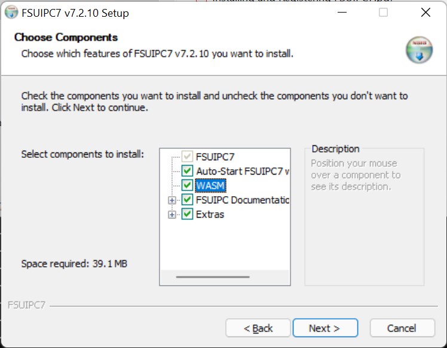
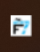
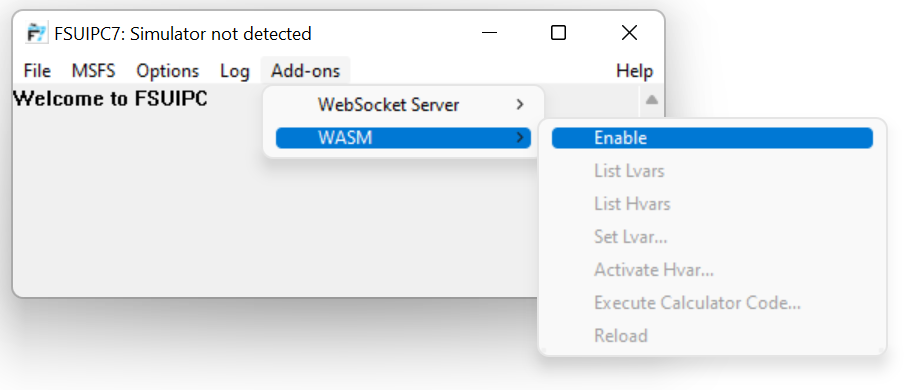

# Better Bravo Lights - Configuring FSUIPC for Lvars

This page explains how to set up FSUIPC, which is needed for Lvar support in Better Bravo Lights (BBL).

## What's an Lvar? What's this FSUIPC thing?

Firstly, it's optional. Better Bravo Lights will work without Lvars and FSUIPC, but a couple of Bravo lights are impossible to configure correctly on Microsoft Flight Simulator without using Lvars.

Basically, Better Bravo Lights needs to ask Flight Simulator about its current state in order to figure out which lights to turn on and off. For example, "Is the autopilot in heading mode? Is the left gear down?"

Some of those pieces of state are easy to access, and BBL can access them directly. These are known as "`A:` variables", and there are [hundreds of them](https://docs.flightsimulator.com/html/Programming_Tools/SimVars/Aircraft_Simulation_Variables.htm).

However, other pieces of state - in particular "`L:` variables" (or 'Lvars') are _much_ harder to get at and require a module to be added to the Community folder. There aren't nearly as many of these variables, but _two_ important states - specifically, `Master Warning` and `Master Caution` are _only_ available via `L:` variables. Some third party aircraft manufacturers also create lots of `L:` variables, and you may want to access those.

BBL can access `A:` variables directly, without help, but if you want to use `L:` variables you'll need to install FSUIPC.

## FSUIPC

[FSUIPC](http://www.fsuipc.com/) is an excellent and mature product and provides a wealth of features for those wanting to extend Flight Simulator, link it to custom hardware, write custom scripts and all sorts of things like that. It can be downloaded and used for free, or you can pay for advanced scripting and automation features. Better Bravo Lights makes use of FSUIPC to get access to Lvars. Either the free or paid version of FSUIPC will work.

Here's how to set FSUIPC to provide Lvars; this only needs to be done once:

1. Download FSUIPC7 from http://www.fsuipc.com/. You'll want the 64-bit version for MSFS, which is probably the first download link.
1. Unpack the zip and run the installer.

   - Make sure the "Auto-Start FSUIPC7 with MSFS" and "WASM" options are both checked in the installation options. Everything else is optional.

     

1. Start FSUIPC7 once, manually, by running `C:\FSUIPC7\FSUIPC7.exe`.
1. It'll start up and then disappear into the system tray. Double-click on its icon  to open its window.
1. In the main FSUIPC7 window, from Addons menu select WASM->Enable:

   

1. That's it! FSUIPC7 is installed, will start with MSFS, and you've enabled its WASM module which will provide Lvar support to Better Bravo Lights and other applications that may need it.
